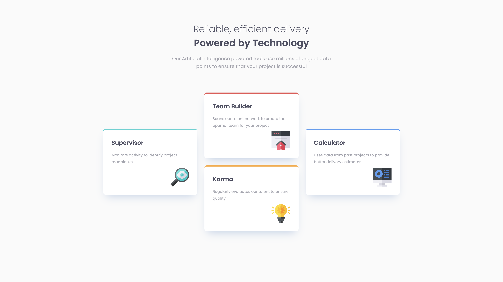

# Four Card Feature Section

 

A responsive, **mobile-first** web page layout that displays four distinctive feature cards. The design focuses on clean typography, color-coded hierarchy, and an adaptive layout that shifts from a single column on mobile to a multi-column grid on desktop.

## Preview

## Concept & Design

The goal of this project was to build a layout that presents "Artificial Intelligence powered tools" in a clear, digestible format.

### Mobile-First Approach

The CSS is written with a **Mobile-First** methodology. This means the base styles are defined for mobile devices (screens smaller than 1200px) first, ensuring the content is accessible and readable on small screens by default.

- **Default View:** A single-column vertical stack.

- **Media Queries:** Larger screens (Desktop) are handled via a `min-width: 1200px` media query, which rearranges the flex items into a row.

### The Layout Strategy (Flexbox)

To achieve the unique desktop layout (where the middle two cards are stacked while the side cards are centered), the HTML structure uses a nested Flexbox approach:

1. **Main Container:** Acts as a Flex row on desktop.

1. **Side Cards:** The "Supervisor" and "Calculator" cards sit as direct children.

1. **Middle Column `(.wrap)`:** A wrapper `div` contains the "Team Builder" and "Karma" cards. This wrapper is a flex column, allowing those two specific cards to stack vertically while remaining in the center of the page.
